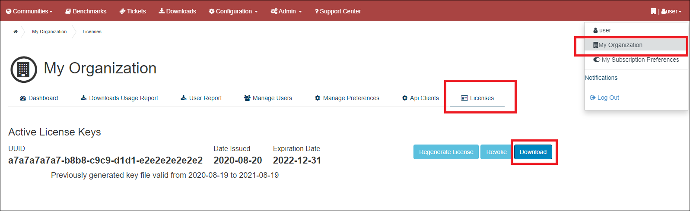

# CIS CSAT Pro Deployment Guide#
----------

##Introduction ##
CIS CSAT Pro is a web application built using the Grails framework. The application uses a graph database known as Neo4j. The documentation below describes how to deploy CIS CSAT Pro on **Windows Server 2019 (64 bit)** operating systems, as well as **Ubuntu 18.04** operating systems; please see the System Recommendations section below for additional details on which operating systems are supported. The  installer for CIS CSAT Pro will set up the application, database, and services for you. We use an embedded version of **Tomcat 9** that comes packaged with Grails, and we also supply **Java 11** that is used for the **Neo4j 3.5 database**, as well as CIS CSAT Pro.

**Please note, you will need to download the latest version of Neo4j Community Edition v3. Please select either the [Windows bundle]( https://neo4j.com/download-thanks/?edition=community&release=3.5.35&flavour=winzip) or the [Unix bundle]( https://neo4j.com/download-thanks/?edition=community&release=3.5.35&flavour=unix) depending on the operating system on which you are installing CIS CSAT Pro.
Be sure that you do not use Neo4j v4 or v5 because they are not currently compatible.**

**Please do not install Neo4j prior to installing CSAT Pro. The CSAT Pro installer will prompt you to point to the Neo4j bundle that you downloaded, and the CSAT Pro installer will then complete the installation of Neo4j using that bundle.**

## System Recommendations ##
While there are no strict requirements associated with CIS CSAT Pro, we do have some recommendations based on what we have tested locally. We recommend that the server has adequate disk space (a minimum of 11GB), as we have configured the installer to install and set up the Neo4j database for the application on the same server as CIS CSAT Pro.

Our test environment used an AWS t2.xlarge instance, which has:

 - 16GB RAM
 - 4 quad core vCPUs

The operating systems CIS used when testing CIS CSAT Pro were Windows Server 2019 and Ubuntu 18.04 (Ubuntu Server and Ubuntu Desktop).  Please note that the installer does not function properly in Windows Server 2019 Core Edition, and that Windows Server 2019 Core Edition is not supported.

For installation in a Windows environment, PowerShell v2.0 or above must also be installed and added to the “Path” environment variable.  This requirement is due to the fact the CSAT Pro installer utilizes Neo4j's Admin utility during the installation process and this utility requires PowerShell to run in a Windows environment (note: please do not install Neo4j prior to installing CSAT Pro; the CSAT Pro installer will have you point to the downloaded Neo4j bundle during installation). See the following link for additional information related to this installation requirement:  [https://neo4j.com/docs/operations-manual/3.5/installation/windows/#powershell](https://neo4j.com/docs/operations-manual/3.5/installation/windows/#powershell)

### Web Browser###
The CIS CSAT Pro officially supports **Google Chrome** web browser. Other browsers may also work but may produce unexpected behavior.

### Port Information###
To access to the application from a remote machine, **port 443** (for HTTPS) or **8080** (for HTTP) needs to be included as an **inbound rule** for your firewall.  

In order to opt in to the [Industry Average Service](../csat_pro_user_guide/#industry-average-service), **port 8883** needs to be included as an **outbound rule**. Online license validation also occurs over port 8883, but this is not required if used in a non-Internet connected environment.

In order for the application to access the SMTP server, **port 25 (default), 465 or 587** (depending on your Email Configuration) needs to be included as an **outbound rule**.

## Installing CIS CSAT Pro##
**This section will do a step-by-step guide on how to deploy CIS CSAT Pro, as well as the Neo4j database.**

 - Locate latest version of CIS CSAT Pro in the Downloads section of [CIS WorkBench](https://workbench.cisecurity.org/).
 - Download the appropriate CIS CSAT Pro bundle for your operating system (installer downloads also available in the [Files section of the CIS WorkBench CSAT Pro community](https://workbench.cisecurity.org/community/118/files)).
 - Extract the bundle on the machine you are using to host CIS CSAT Pro. 
 **Note:** For Windows environments, we suggest that you do NOT extract the bundle inside the `c:\Users` directory or its sub-directories because this can lead to permission issues. Instead, please create a new directory (for example `c:\csatFiles`) to extract the bundle.
 - Execute the CIS CSAT Pro Installer (`CSAT_Pro_unix_Installer.sh or CSAT_Pro_windows-x64_Installer.exe`) as root or user that has root privileges.
  Please make sure there are no restrictions in your system that will prevent applications that run inside  `C:\Users\MYUSER~1\AppData` from accessing other directories like `c:/Program Files/CSATPro/neo4j`. If such restrictions are in place, you will need to install CSAT Pro after either temporarily disabling the restriction, or after configuring a bypass for CSAT Pro and related applications like Neo4j (for instance, allowlisting these applications).  For example, certain malware prevention GPO settings can prevent successful installation of CSAT Pro.

####Welcome####
First, you will be brought to a welcome screen, stating you are installing CIS CSAT Pro.

####Select Destination Directory####
Select the location of where the CIS CSAT Pro application, as well as Neo4j database, and included version of Java will be installed.

####Select Configuration and License Directories####
On this screen, you will be selecting the configuration and license files needed for the application. You can find out more information on how to get these files in the [Obtaining Configuration Files](#obtainingConfigFiles) section in the deployment guide. We ask that these files are kept in the same directory with each other. If they aren't, the application will not be able to run.

The first file to be selected is the **Integration Configuration File**. Please enter the path to the <u>dxlclient.config</u> file, including the file name.

The next file to be selected is the **License Key** file. Please enter the path to the <u>license.xml</u> file, including the file name.

####Email Configuration####
CIS CSAT Pro must be able to connect to and utilize a valid SMTP server in order to send email messages. CIS CSAT Pro utilizes the Grails mail plugin for email communication.
Along with the default sender email address, CIS CSAT Pro's mailing configuration must also include connection to a valid SMTP server in order to correctly distribute the "forgot password" messages, One Time Passcode messages for MFA, and Safeguard workflow messages such as task assignment. Numerous SMTP services exist, such as Gmail, Hotmail, Amazon SES, or in-house SMTP services available through corporate emailing technologies, such as Exchange. CIS CSAT Pro can support these SMTP servers, as long as the connection information entered below is correct. By default, the plugin assumes an unsecured mail server configured at `localhost` on `port 25`. However, this can be modified in the email configuration screen.

####Multi-Factor Authentication (MFA) Configuration####
The MFA Configuration page allows you to select whether MFA is enabled or disabled for the CSAT Pro instance.  MFA requires email, as it will email a One Time Passcode to the user during the login process.  MFA is an important security feature, and we strongly recommend MFA be enabled for CSAT Pro.

####Password Configuration####
The Password Configuration page allows you to select password length requirements for all users in the entire CSAT Pro instance, as well as the Neo4j database admin and TLS keystore passwords. The minimum must be at least 8 characters and the maximum can be up to 127 characters. CIS recommends at least a 14 character minimum if MFA is not being used, or at least an 8 character minimum if MFA is being used.

####Set up TLS Configuration####
This screen is to set up TLS configuration. This screen has 3 options as to how you want to set up TLS for the CIS CSAT Pro application. Encrypting data in transit is important for security, and we strongly recommend that TLS be enabled for CSAT Pro.

Please allow network traffic through the port specific to which option you select. We have listed the default port numbers for each option below.

----------

By default, we select generating a self-signed PKCS12 certificate, to allow for HTTPS protection to the application. Here we ask for 2 fields to be filled out, so we can generate the certificate for you. The default port for this option is **443**.

 - <b>Alias</b> - This will be the alias, as well as the key file name.
 - <b>Keystore Password</b> - This will be the password for access to the certificate. Must meet the requirements set on the Password Configuration page.

----------

The second option is if you already have a certificate (self-signed or a certificate authority) that you would like CIS CSAT Pro to use. The default port for this option is **443**.

 - **Certificate** - File path to the existing certificate.
 - **Alias** - Alias name for the existing certificate.
 - **Keystore Password** - Keystore password for the existing certificate. Must meet the requirements set on the Password Configuration page.
 - **Key Password** - Key password for the existing password. Must meet the requirements set on the Password Configuration page.

----------

The third option is our least recommended option in terms of security. This will allow for only HTTP requests, which will only have unencrypted communication to CIS CSAT Pro. By default, the port for this option is **8080**.

####Installation####
In this section, the installer will be extracting all necessary files into the installation directory chosen. This process may take a few minutes.

###Download Neo4j Server##
Here, you will need to go through the file selector, and select the bundled Neo4j server file you downloaded, as mentioned in the [**introduction**](#introduction). There is no need to unzip the file from Neo4j, as the installer application will handle all of this for you.

####Set Up Database Admin####
On this page, we need to set up the password for the Neo4j database admin user. By default, the user name is `neo4j`. The password has some requirements, which are: 1 letter, 1 number, 1 special character `!@#$%^&`, and must meet the requirements set on the Password Configuration page.

####Set Up CSAT Admin User####
On this page, we need to set up the default System Administrator for the CSAT Pro application. By default, the user name is `admin`. The password has the following requirements: 1 letter, 1 number, 1 special character `!@#$%^&`, and must meet the requirements set on the Password Configuration page.

####Installing and Starting CIS CSAT Pro####
Here, the installer is starting up the Neo4j service, and is creating and starting the CIS CSAT Pro service. This can take a few minutes.

####Finished####
At this point, the installer has finished setting up and CIS CSAT Pro is starting. It may take a few minutes for the application to be accessible. To get access to the site, please go to `https://<hostname>` if you are using TLS, or `http://<hostname>:8080` if you chose to not use TLS. From here, you can check out the [User Guide](../csat_pro_user_guide) on how to log in and use CIS CSAT Pro.

##Upgrading CIS CSAT Pro##
If you are updating CIS CSAT Pro, we have worked on making this process as easy as possible. Download the new version of CIS CSAT Pro from CIS WorkBench, and run the installer executable on the machine that already has CIS CSAT Pro installed. The installer will detect an existing installation and ask you to verify the installation directory. At this point, it will stop the CIS CSAT Pro application, deploy the new version of the application, and start the application back up. Just like the initial install, it will take the application a few minutes to fully come back up.

When updating an existing installation of CIS CSAT Pro, you have the choice of whether to update the existing configuration, or keep the configuration settings unchanged.  When the installer detects the previous installation and you have the “Yes, update the existing installation” option selected, you can choose whether or not to check the box by “Update the configuration file by populating the installer with the settings from the existing configuration file for the current CSAT Pro installation on this system”.  If you check this box, the values from the existing CSAT Pro configuration file will be populated in the installer, allowing you to see the existing values and make changes if you wish (note: blank values in the config file will be displayed as empty values in the installer).  If you leave this box unchecked, the installer will not prompt you for the configuration file values, and your existing CSAT Pro configuration settings will remain unchanged.  Please note: you can also use the installer in this manner to change configuration settings, even if you aren’t in the process of upgrading to a new version of CIS CSAT Pro.

## Obtaining Configuration Files##
Your organization’s license file and configuration files can be obtained through [CIS WorkBench](https://workbench.cisecurity.org/).  After logging into WorkBench, members can click on their company information (reachable from the down arrow near the user’s username in the upper right corner of the page and then clicking on the company’s name in that menu).  On the company information page, click on “Licenses” from the menu below the company name.  This will take the member to a page that shows the company’s Active License Keys.  The member should then download the license bundle by clicking the “Download” button as follows: 

Note: If this page says “There are no active license keys for this organization”, then the member will need to contact [CIS Support](https://www.cisecurity.org/support/).  

Once downloaded, you should unzip the files.  Two of the files that will be extracted from this bundle are the dxlclient.config file and the license.xml file.  During the installation process, you will browse to these files when prompted by the installer as described above in the Select Configuration and License Directories section.

## Restarting CIS CSAT Pro application service##

Restarting CSAT Pro application service is required for example when the [license is renewed](../csat_pro_user_guide/#license).

The following steps will not wipe your existing data.

Here are the steps to restart CSAT Pro application service from your system.

###Windows Server 2019 environment###

1) Go to Windows Services application

2) Right click `restart` on `CSAT_Pro Windows` service. 

Note: Windows Services application is accessible by typing `Services` in the Windows search.

###Ubuntu 18 environment###
Execute the following command as root or user that has root privileges (use "sudo" or "su" to elevate your privileges).

1) Restart `CSAT` service with the following command:

	systemctl restart CSAT

## Uninstalling CIS CSAT Pro##

Here are the steps to manually uninstall CSAT Pro from your system.

###Windows Server 2019 environment###

1) Stop `neo4j` and `CSAT_Pro Windows` services from Windows Services application. 

Note: Windows Services application is accessible by typing `Services` in the Windows search.

2) Delete your install directory.

3) Delete `CSAT_CONFIG_FILE` and `CSAT_LOG_DIR` environment variables.

4) Delete `JAVA_HOME` environment variable if `JAVA_HOME` points to your installer directory.

5) Run a command prompt as an administrator and delete both services with the following command: 

	SC DELETE neo4j
	SC DELETE "CSAT_Pro Windows"

###Ubuntu 18 environment###
Execute the following commands as root or user that has root privileges (use "sudo" or "su" to elevate your privileges).

1) Stop `neo4j` and `CSAT` services:

	systemctl stop CSAT
	systemctl stop neo4j

2) Disable `neo4j` and `CSAT` services:

	systemctl disable CSAT
	systemctl disable neo4j

3) Delete `neo4j` service:
	
	rm /etc/systemd/system/neo4j

Note: the `CSAT` service is linked to the installer directory, so once disabled, the link should disappear from `/etc/systemd/system/`

4) Delete your installer directory.

5) Reload all unit files:
 
	systemctl daemon-reload
